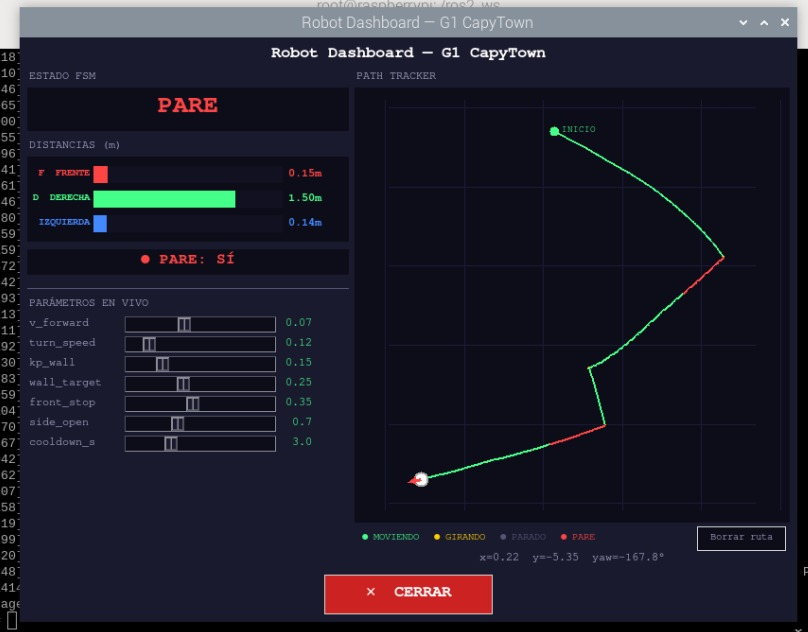
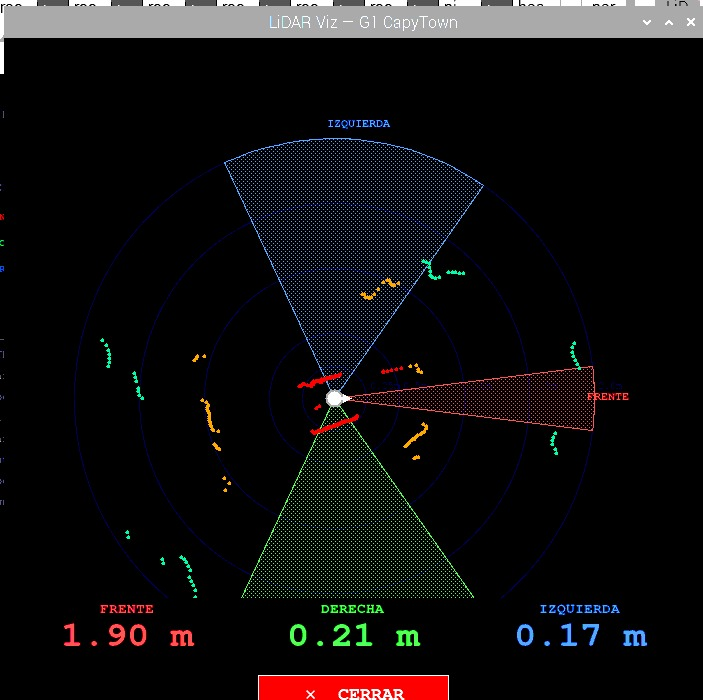
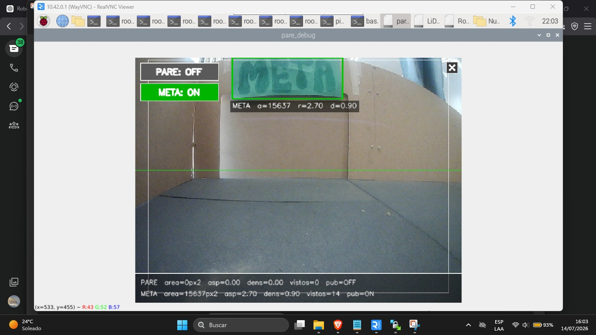
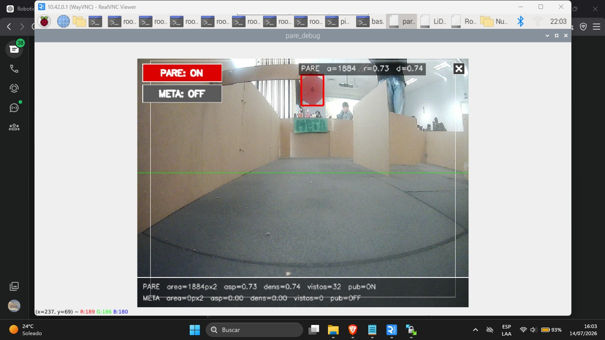

# Reto Final de Robótica — CapyTown Grand Prix

## Descripción del reto

Este proyecto desarrolla un sistema de navegación autónoma para un robot Yahboom equipado con LiDAR, cámara y sensores de odometría.

El objetivo del reto es que el robot recorra un laberinto de forma autónoma, evite obstáculos, detecte intersecciones y callejones, respete señales de PARE y se detenga al reconocer la META.

La solución combina procesamiento de datos LiDAR, visión artificial y una máquina de estados. Además, utiliza el algoritmo de Trémaux y aprendizaje por refuerzo mediante Q-learning para reducir recorridos repetidos y mejorar la toma de decisiones durante la navegación.

## Funcionalidades principales

- Seguimiento autónomo de paredes.
- Detección de obstáculos mediante LiDAR.
- Identificación de intersecciones y callejones.
- Giros controlados utilizando la orientación del robot.
- Memoria de caminos mediante el algoritmo de Trémaux.
- Aprendizaje de decisiones con Q-learning.
- Detección visual de señales PARE.
- Detección visual de la META.
- Detención de seguridad ante pérdida de sensores.
- Registro de métricas del recorrido.

## Dashboard del robot

## Visualización del LiDAR

## Detección de META

## Detección de PARE

