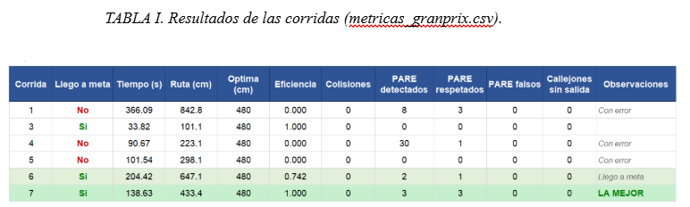

# Reto Final de Robótica — CapyTown Grand Prix

## Descripción del reto

Este proyecto desarrolla un sistema de navegación autónoma para un robot Yahboom equipado con LiDAR, cámara y sensores de odometría.

El objetivo del reto es que el robot recorra un laberinto de forma autónoma, evite obstáculos, detecte intersecciones y callejones, respete señales de PARE y se detenga al reconocer la META.

La solución combina procesamiento de datos LiDAR, visión artificial y una máquina de estados. Además, utiliza el algoritmo de Trémaux y aprendizaje por refuerzo mediante Q-learning para reducir recorridos repetidos y mejorar la toma de decisiones durante la navegación.

## Funcionalidades principales

- Seguimiento autónomo de paredes.
- Detección de obstáculos mediante LiDAR.
- Identificación de intersecciones y callejones.
- Giros controlados utilizando la orientación del robot.
- Memoria de caminos mediante el algoritmo de Trémaux.
- Aprendizaje de decisiones con Q-learning.
- Detección visual de señales PARE.
- Detección visual de la META.
- Detención de seguridad ante pérdida de sensores.
- Registro de métricas del recorrido.

## Dashboard del robot

<p align="center">
  
</p>

## Visualización del LiDAR

<p align="center">
  
</p>

## Detección de META

<p align="center">
  
</p>

## Detección de PARE

<p align="center">
  
</p>

# Métricas resultantes de las corridas

<p align="center">
  
</p>

---

# Instrucciones de instalación y ejecución

## 1. Requisitos previos

Antes de comenzar, se debe comprobar lo siguiente:

- El contenedor Docker del robot debe estar iniciado.
- ROS 2 debe estar instalado y configurado dentro del contenedor.
- El LiDAR, la cámara y la odometría deben encontrarse conectados.
- Los archivos del proyecto deben estar en la siguiente carpeta de la Raspberry Pi:

```bash
/home/pi/NuevoProyecto/
```

Los archivos esperados son:

```text
maze_solver.py
pare_detector.py
ver_pare_debug.py
robot_dashboard.py
lidar_viz.py
dashboard_g1.py
q_table_granprix_FINAL.json
```

En estas instrucciones se utiliza el siguiente identificador de contenedor:

```text
28404cc840d6
```

Este identificador puede verificarse desde la Raspberry Pi ejecutando:

```bash
docker ps
```

Si el identificador mostrado por `docker ps` es diferente, se debe reemplazar `28404cc840d6` en todos los comandos.

---

# 2. Creación inicial del paquete ROS 2

Esta preparación solo es necesaria cuando se crea nuevamente el workspace, se eliminó el paquete o se desea realizar una instalación limpia.

## Terminal de preparación

Abrir una terminal en la Raspberry Pi e ingresar al contenedor:

```bash
docker exec -it 28404cc840d6 bash
```

Dentro del contenedor, eliminar el workspace anterior y crear uno nuevo:

```bash
rm -rf /ros2_ws
mkdir -p /ros2_ws/src
cd /ros2_ws/src
```

Crear el paquete ROS 2 llamado `capytown`:

```bash
ros2 pkg create capytown \
  --build-type ament_python \
  --dependencies rclpy sensor_msgs geometry_msgs nav_msgs std_msgs
```

Salir temporalmente del contenedor:

```bash
exit
```

---

# 3. Copia de los archivos al contenedor

Los siguientes comandos se ejecutan desde la terminal normal de la Raspberry Pi, fuera del contenedor.

Copiar el nodo principal de navegación:

```bash
docker cp /home/pi/NuevoProyecto/maze_solver.py \
28404cc840d6:/ros2_ws/src/capytown/capytown/maze_solver.py
```

Copiar el nodo de detección de señales:

```bash
docker cp /home/pi/NuevoProyecto/pare_detector.py \
28404cc840d6:/ros2_ws/src/capytown/capytown/pare_detector.py
```

Copiar el visualizador de depuración de cámara:

```bash
docker cp /home/pi/NuevoProyecto/ver_pare_debug.py \
28404cc840d6:/ros2_ws/src/capytown/capytown/ver_pare_debug.py
```

Copiar el dashboard principal:

```bash
docker cp /home/pi/NuevoProyecto/robot_dashboard.py \
28404cc840d6:/ros2_ws/src/capytown/capytown/robot_dashboard.py
```

Copiar el visualizador del LiDAR:

```bash
docker cp /home/pi/NuevoProyecto/lidar_viz.py \
28404cc840d6:/ros2_ws/src/capytown/capytown/lidar_viz.py
```

Copiar el dashboard adicional del Grupo 1:

```bash
docker cp /home/pi/NuevoProyecto/dashboard_g1.py \
28404cc840d6:/ros2_ws/src/capytown/capytown/dashboard_g1.py
```

Copiar la tabla Q utilizada por el algoritmo de Q-learning:

```bash
docker cp /home/pi/NuevoProyecto/q_table_granprix_FINAL.json \
28404cc840d6:/ros2_ws/q_table_granprix.json
```

La tabla se copia con el nombre:

```text
/ros2_ws/q_table_granprix.json
```

Este es el archivo que utiliza el nodo de navegación para consultar y actualizar los valores aprendidos.

---

# 4. Creación del nodo publicador de cámara

Volver a ingresar al contenedor:

```bash
docker exec -it 28404cc840d6 bash
```

Crear el archivo `camera_publisher.py`:

```bash
cat > /ros2_ws/src/capytown/capytown/camera_publisher.py <<'PY'
#!/usr/bin/env python3

import cv2
import numpy as np

import rclpy
from rclpy.node import Node
from sensor_msgs.msg import Image


class CameraPublisher(Node):

    def __init__(self):
        super().__init__('camera_publisher')

        self.declare_parameter('device', 0)
        self.declare_parameter('width', 640)
        self.declare_parameter('height', 480)
        self.declare_parameter('fps', 15.0)
        self.declare_parameter('topic', '/camera/image_raw')

        device = int(self.get_parameter('device').value)
        width = int(self.get_parameter('width').value)
        height = int(self.get_parameter('height').value)
        self.fps = float(self.get_parameter('fps').value)
        topic = str(self.get_parameter('topic').value)

        self.cap = cv2.VideoCapture(device, cv2.CAP_V4L2)
        self.cap.set(cv2.CAP_PROP_FRAME_WIDTH, width)
        self.cap.set(cv2.CAP_PROP_FRAME_HEIGHT, height)
        self.cap.set(cv2.CAP_PROP_FPS, self.fps)

        if not self.cap.isOpened():
            raise RuntimeError(f'No se pudo abrir /dev/video{device}')

        self.publisher = self.create_publisher(Image, topic, 10)
        self.timer = self.create_timer(
            1.0 / max(self.fps, 1.0),
            self.publicar
        )

        self.get_logger().info(
            f'Cámara /dev/video{device} abierta → {topic} '
            f'({width}x{height} @ {self.fps:.1f} FPS)'
        )

    def publicar(self):
        ok, frame = self.cap.read()

        if not ok or frame is None:
            self.get_logger().warning('No se pudo leer un frame')
            return

        frame = np.ascontiguousarray(frame)

        msg = Image()
        msg.header.stamp = self.get_clock().now().to_msg()
        msg.header.frame_id = 'camera'
        msg.height = frame.shape[0]
        msg.width = frame.shape[1]
        msg.encoding = 'bgr8'
        msg.is_bigendian = 0
        msg.step = frame.shape[1] * 3
        msg.data = frame.tobytes()

        self.publisher.publish(msg)

    def destroy_node(self):
        if hasattr(self, 'cap'):
            self.cap.release()

        super().destroy_node()


def main(args=None):
    rclpy.init(args=args)
    nodo = CameraPublisher()

    try:
        rclpy.spin(nodo)
    except KeyboardInterrupt:
        pass
    finally:
        nodo.destroy_node()

        if rclpy.ok():
            rclpy.shutdown()


if __name__ == '__main__':
    main()
PY
```

Este nodo abre la cámara física del robot y publica las imágenes en el tópico:

```text
/camera/image_raw
```

El nodo `pare_detector` se suscribe a este tópico para detectar las señales de PARE y META.

---

# 5. Configuración del archivo setup.py

Crear o reemplazar el archivo `setup.py`:

```bash
cat > /ros2_ws/src/capytown/setup.py <<'PY'
from setuptools import find_packages, setup

package_name = 'capytown'

setup(
    name=package_name,
    version='0.0.0',
    packages=find_packages(exclude=['test']),
    data_files=[
        (
            'share/ament_index/resource_index/packages',
            ['resource/' + package_name]
        ),
        (
            'share/' + package_name,
            ['package.xml']
        ),
    ],
    install_requires=['setuptools'],
    zip_safe=True,
    maintainer='g1',
    maintainer_email='g1@example.com',
    description='CapyTown Grand Prix G1',
    license='MIT',
    tests_require=['pytest'],
    entry_points={
        'console_scripts': [
            'camera_publisher = capytown.camera_publisher:main',
            'maze_solver = capytown.maze_solver:main',
            'pare_detector = capytown.pare_detector:main',
            'ver_pare_debug = capytown.ver_pare_debug:main',
            'robot_dashboard = capytown.robot_dashboard:main',
            'lidar_viz = capytown.lidar_viz:main',
            'dashboard_g1 = capytown.dashboard_g1:main',
        ],
    },
)
PY
```

El archivo `setup.py` registra los nodos del proyecto como comandos ejecutables de ROS 2.

Gracias a esta configuración, los nodos pueden iniciarse utilizando comandos como:

```bash
ros2 run capytown maze_solver
```

---

# 6. Verificación de las funciones main()

Los archivos `lidar_viz.py` y `robot_dashboard.py` deben tener una función `main()` para que ROS 2 pueda ejecutarlos mediante las entradas declaradas en `setup.py`.

Ejecutar el siguiente script dentro del contenedor:

```bash
python3 - <<'PY'
from pathlib import Path

archivos = [
    (
        Path("/ros2_ws/src/capytown/capytown/lidar_viz.py"),
        "LidarViz"
    ),
    (
        Path("/ros2_ws/src/capytown/capytown/robot_dashboard.py"),
        "Dashboard"
    ),
]

for ruta, clase in archivos:
    texto = ruta.read_text()

    if "def main(" in texto:
        print(f"{ruta.name}: ya tiene main()")
        continue

    texto += f"""


def main(args=None):
    {clase}()


if __name__ == '__main__':
    main()
"""

    ruta.write_text(texto)
    print(f"{ruta.name}: main() agregado usando {clase}")
PY
```

El script revisa ambos archivos:

- Si ya tienen una función `main()`, no realiza cambios.
- Si no tienen una función `main()`, la agrega automáticamente.

---

# 7. Compilación del proyecto

Dentro del contenedor, ejecutar:

```bash
cd /ros2_ws
rm -rf build install log
colcon build --packages-select capytown --symlink-install
```

Cuando la compilación termine correctamente, cargar el workspace:

```bash
source /ros2_ws/install/setup.bash
```

Para verificar que ROS 2 reconoce los ejecutables:

```bash
ros2 pkg executables capytown
```

Deberían aparecer ejecutables similares a los siguientes:

```text
capytown camera_publisher
capytown dashboard_g1
capytown lidar_viz
capytown maze_solver
capytown pare_detector
capytown robot_dashboard
capytown ver_pare_debug
```

Salir del contenedor:

```bash
exit
```

---

# 8. Ejecución del sistema

Para ejecutar el proyecto completo se utilizan seis terminales.

Cada nodo debe permanecer ejecutándose en su propia terminal. No se debe cerrar una terminal después de iniciar un nodo.

El orden recomendado es:

1. Publicador de cámara.
2. Detector de señales.
3. Ventana de depuración visual.
4. Visualización del LiDAR.
5. Dashboard del robot.
6. Navegación autónoma.

---

## Terminal 1 — Publicador de cámara

Abrir una nueva terminal en la Raspberry Pi:

```bash
docker exec -it 28404cc840d6 bash
```

Dentro del contenedor, ejecutar:

```bash
cd /ros2_ws
source install/setup.bash
export ROS_DOMAIN_ID=20
```

Iniciar el nodo de cámara:

```bash
ros2 run capytown camera_publisher --ros-args \
-p device:=0
```

Esta terminal debe permanecer abierta.

El nodo publica las imágenes capturadas por la cámara en:

```text
/camera/image_raw
```

Para verificar la publicación se puede abrir otra terminal temporal y ejecutar:

```bash
ros2 topic hz /camera/image_raw
```

---

## Terminal 2 — Detector de PARE y META

Abrir otra terminal:

```bash
docker exec -it 28404cc840d6 bash
```

Preparar el entorno:

```bash
cd /ros2_ws
source install/setup.bash
export ROS_DOMAIN_ID=20
```

Se debe elegir solamente uno de los siguientes perfiles.

No se deben ejecutar los tres perfiles al mismo tiempo.

### Perfil 1 — Detección estricta

```bash
ros2 run capytown pare_detector --ros-args \
-p image_topic:=/camera/image_raw \
-p meta_area_min:=12000 \
-p meta_frames_confirm:=8 \
-p meta_s_min:=80 \
-p meta_v_min:=50
```

Este perfil exige que la región detectada sea grande, tenga suficiente saturación y sea observada durante varios fotogramas.

Reduce falsos positivos, pero requiere que la señal META se encuentre más cerca o sea más visible.

### Perfil 2 — Detección menos estricta

```bash
ros2 run capytown pare_detector --ros-args \
-p image_topic:=/camera/image_raw \
-p meta_area_min:=8000 \
-p meta_frames_confirm:=5 \
-p meta_s_min:=60 \
-p meta_v_min:=40
```

Este perfil permite detectar la META desde una mayor distancia.

Es más sensible, pero puede aumentar la posibilidad de detectar objetos similares por error.

### Perfil 3 — Detección más estricta para PARE y META

```bash
ros2 run capytown pare_detector --ros-args \
-p image_topic:=/camera/image_raw \
-p pare_area_max:=14000 \
-p pare_densidad_min:=0.45 \
-p pare_frames_confirm:=5 \
-p meta_area_min:=12000 \
-p meta_frames_confirm:=8 \
-p meta_s_min:=80 \
-p meta_v_min:=50
```

Este perfil aplica restricciones adicionales tanto para la señal PARE como para la META.

Es el perfil recomendado cuando existen muchos elementos rojos o verdes alrededor del circuito que podrían causar falsas detecciones.

Esta terminal debe permanecer abierta.

---

## Terminal 3 — Depuración visual de PARE y META

Abrir otra terminal:

```bash
docker exec -it 28404cc840d6 bash
```

Preparar el entorno:

```bash
cd /ros2_ws
source install/setup.bash
export ROS_DOMAIN_ID=20
export DISPLAY=:0
```

Ejecutar el visualizador:

```bash
ros2 run capytown ver_pare_debug
```

Esta ventana permite observar:

- La imagen recibida desde la cámara.
- Las regiones analizadas.
- Las máscaras de color.
- La detección de la señal PARE.
- La detección de la META.
- Los cuadros o contornos encontrados por el detector.

Esta terminal debe permanecer abierta.

---

## Terminal 4 — Visualización del LiDAR

Abrir otra terminal:

```bash
docker exec -it 28404cc840d6 bash
```

Preparar el entorno:

```bash
cd /ros2_ws
source install/setup.bash
export ROS_DOMAIN_ID=20
export DISPLAY=:0
```

Ejecutar el visualizador LiDAR:

```bash
ros2 run capytown lidar_viz
```

La visualización permite observar:

- Los puntos detectados alrededor del robot.
- La distancia frontal.
- Las distancias laterales.
- Las paredes del laberinto.
- Los espacios abiertos.
- Los posibles obstáculos.
- Las intersecciones detectadas por el sistema.

Esta terminal debe permanecer abierta.

---

## Terminal 5 — Dashboard del robot

Abrir otra terminal:

```bash
docker exec -it 28404cc840d6 bash
```

Preparar el entorno:

```bash
cd /ros2_ws
source install/setup.bash
export ROS_DOMAIN_ID=20
export DISPLAY=:0
```

Ejecutar el dashboard principal:

```bash
ros2 run capytown robot_dashboard
```

El dashboard muestra información relacionada con:

- Estado actual del robot.
- Estado de la máquina de navegación.
- Distancias detectadas.
- Acción seleccionada.
- Orientación y odometría.
- Señales visuales detectadas.
- Intersecciones.
- Decisiones del algoritmo.
- Métricas acumuladas durante el recorrido.

Esta terminal debe permanecer abierta.

### Dashboard alternativo

El archivo `dashboard_g1.py` también está registrado como ejecutable.

Puede utilizarse en lugar de `robot_dashboard` ejecutando:

```bash
ros2 run capytown dashboard_g1
```

No es obligatorio ejecutar ambos dashboards al mismo tiempo.

---

## Terminal 6 — Navegación autónoma

La navegación debe iniciarse después de comprobar que:

- La cámara está publicando imágenes.
- El detector de señales está activo.
- El LiDAR está publicando datos.
- La odometría está disponible.
- Las ventanas de depuración funcionan.
- El robot se encuentra correctamente colocado en la salida.

Abrir la sexta terminal:

```bash
docker exec -it 28404cc840d6 bash
```

Preparar el entorno:

```bash
cd /ros2_ws
source install/setup.bash
export ROS_DOMAIN_ID=20
```

Ejecutar el nodo principal:

```bash
ros2 run capytown maze_solver --ros-args \
-p ronda:=0 \
-p qlearn_enabled:=true \
-p q_epsilon:=0.0 \
-p q_alpha:=0.30 \
-p v_forward:=0.050 \
-p turn_speed:=0.16 \
-p front_stop:=0.42 \
-p side_open:=1.10 \
-p side_confirm_ticks:=7 \
-p side_rearm_wall_max:=0.72 \
-p side_rearm_ticks:=6 \
-p intersection_min_exit_m:=0.48 \
-p startup_side_guard_s:=6.50 \
-p startup_min_travel_m:=0.25 \
-p intersection_center_distance_m:=0.11 \
-p intersection_center_timeout_s:=3.50 \
-p intersection_center_v:=0.040 \
-p intersection_center_front_min:=0.58 \
-p memory_node_radius:=0.45 \
-p intersection_cooldown_s:=6.5 \
-p scan_timeout_s:=0.80 \
-p post_turn_stop_s:=0.40 \
-p turn_slowdown_deg:=25.0 \
-p turn_near_speed:=0.10 \
-p turn_brake_margin_deg:=0.5 \
-p giro_front_safety:=0.22 \
-p giro_yaw_min_deg:=84.0 \
-p media_yaw_min_deg:=165.0 \
-p giro_timeout_s:=16.0 \
-p media_timeout_s:=28.0 \
-p meta_confirm_s:=0.80 \
-p meta_min_distance_m:=2.50 \
-p meta_min_runtime_s:=25.0
```

Al ejecutar este comando, el robot comienza la navegación autónoma.

---

# 9. Explicación de los principales parámetros

## Parámetros de Q-learning

```text
qlearn_enabled
```

Activa o desactiva el uso de Q-learning.

```text
q_epsilon
```

Controla la probabilidad de que el robot explore una decisión diferente.

Con:

```text
q_epsilon = 0.0
```

el robot no realiza exploración aleatoria y utiliza las decisiones conocidas de la tabla Q.

```text
q_alpha
```

Controla cuánto afectan las experiencias nuevas a los valores almacenados en la tabla Q.

---

## Parámetros de movimiento

```text
v_forward
```

Velocidad lineal utilizada durante el avance normal.

```text
turn_speed
```

Velocidad angular utilizada durante los giros.

```text
front_stop
```

Distancia frontal mínima a partir de la cual el robot considera que existe un obstáculo.

```text
turn_slowdown_deg
```

Cantidad de grados restantes a partir de la cual el robot comienza a reducir la velocidad de giro.

```text
turn_near_speed
```

Velocidad angular utilizada cuando el robot se encuentra cerca de completar el giro.

---

## Parámetros de intersecciones

```text
side_open
```

Distancia lateral utilizada para considerar que existe un camino abierto.

```text
side_confirm_ticks
```

Cantidad de lecturas consecutivas necesarias para confirmar una apertura lateral.

```text
intersection_center_distance_m
```

Distancia que el robot avanza para aproximarse al centro de una intersección antes de tomar una decisión.

```text
intersection_cooldown_s
```

Tiempo durante el cual se evita volver a registrar inmediatamente la misma intersección.

```text
memory_node_radius
```

Radio utilizado para determinar si una posición corresponde a una intersección ya registrada.

---

## Parámetros de giro

```text
giro_yaw_min_deg
```

Cambio mínimo de orientación requerido para considerar terminado un giro de aproximadamente 90 grados.

```text
media_yaw_min_deg
```

Cambio mínimo de orientación requerido para considerar terminada una media vuelta.

```text
giro_timeout_s
```

Tiempo máximo permitido para completar un giro normal.

```text
media_timeout_s
```

Tiempo máximo permitido para completar una media vuelta.

```text
giro_front_safety
```

Distancia frontal de seguridad durante la ejecución de un giro.

---

## Parámetros de detección de META

```text
meta_confirm_s
```

Tiempo durante el cual la detección de META debe mantenerse antes de ser aceptada.

```text
meta_min_distance_m
```

Distancia mínima que debe haber recorrido el robot antes de permitir la finalización por META.

```text
meta_min_runtime_s
```

Tiempo mínimo que debe haber transcurrido desde el inicio de la carrera antes de aceptar la META.

Estas restricciones evitan que el robot termine accidentalmente la carrera debido a una detección falsa al inicio.

---

# 10. Reinicio opcional de la tabla Q

Para comenzar una corrida sin utilizar el archivo de aprendizaje anterior, se puede eliminar la tabla Q antes de ejecutar `maze_solver`.

Dentro del contenedor:

```bash
rm -f /ros2_ws/q_table_granprix.json
```

Este comando es opcional.

Debe utilizarse únicamente cuando se desea reiniciar el aprendizaje.

Al eliminar el archivo:

- Se pierden las decisiones aprendidas en corridas anteriores.
- El robot inicia con una tabla vacía o con valores predeterminados.
- No se conservarán las penalizaciones y recompensas acumuladas.

No se debe ejecutar este comando después de una corrida si se desea conservar el aprendizaje obtenido.

Para volver a utilizar la tabla original, copiarla nuevamente desde la Raspberry Pi:

```bash
docker cp /home/pi/NuevoProyecto/q_table_granprix_FINAL.json \
28404cc840d6:/ros2_ws/q_table_granprix.json
```

---

# 11. Verificación previa a la carrera

Antes de iniciar `maze_solver`, comprobar los tópicos disponibles:

```bash
ros2 topic list
```

Como mínimo, deberían estar disponibles tópicos equivalentes a:

```text
/camera/image_raw
/scan
/odom_raw
/cmd_vel
```

Verificar la cámara:

```bash
ros2 topic hz /camera/image_raw
```

Verificar el LiDAR:

```bash
ros2 topic hz /scan
```

Verificar la odometría:

```bash
ros2 topic hz /odom_raw
```

Verificar que el tópico de comandos de movimiento existe:

```bash
ros2 topic info /cmd_vel
```

Si alguno de los sensores no publica información, no se debe iniciar la navegación.

---

# 12. Orden resumido de ejecución

| Terminal   | Nodo               | Función                                       |
| ---------- | ------------------ | --------------------------------------------- |
| Terminal 1 | `camera_publisher` | Captura y publica la imagen de la cámara.     |
| Terminal 2 | `pare_detector`    | Detecta señales PARE y META.                  |
| Terminal 3 | `ver_pare_debug`   | Muestra la depuración visual de la detección. |
| Terminal 4 | `lidar_viz`        | Muestra gráficamente los datos LiDAR.         |
| Terminal 5 | `robot_dashboard`  | Presenta estados y métricas del robot.        |
| Terminal 6 | `maze_solver`      | Controla la navegación autónoma.              |

El nodo `maze_solver` siempre debe ejecutarse al final, después de comprobar que los sensores y los demás nodos se encuentran funcionando correctamente.

---

# 13. Detención del sistema

Para detener un nodo, utilizar:

```text
Ctrl + C
```

El orden recomendado para detener el sistema es:

1. Detener `maze_solver`.
2. Detener `pare_detector`.
3. Detener `camera_publisher`.
4. Cerrar `ver_pare_debug`.
5. Cerrar `lidar_viz`.
6. Cerrar `robot_dashboard`.

El nodo `maze_solver` debe detenerse primero para evitar que el robot continúe enviando velocidades mientras los sensores o sistemas auxiliares se están cerrando.

Como medida adicional de seguridad, se puede publicar una velocidad igual a cero:

```bash
ros2 topic pub --once /cmd_vel geometry_msgs/msg/Twist \
"{linear: {x: 0.0, y: 0.0, z: 0.0}, angular: {x: 0.0, y: 0.0, z: 0.0}}"
```
